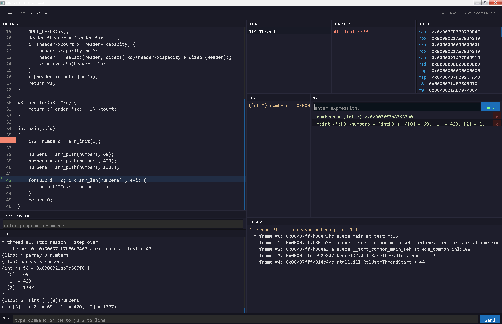

# LDB2
A frontend for the LLDB debugger.



Built with [RGFW](https://github.com/ColleagueRiley/RGFW) and [QuickUI](https://github.com/Mr-Emacs/quick-ui).

## Platform Support
Windows and Linux only. Linux support coming soon.

## Build
**Windows** — Requires `lldb.exe` and clang or MSVC.
**Linux** — Requires `lldb` and clang or gcc.
```
make
```

## License
MIT — feel free to contribute.
